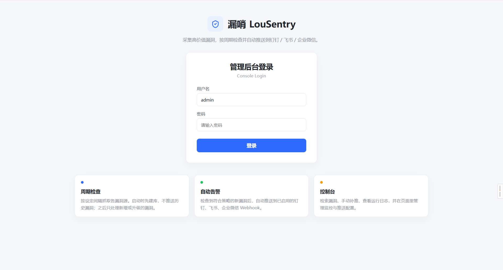
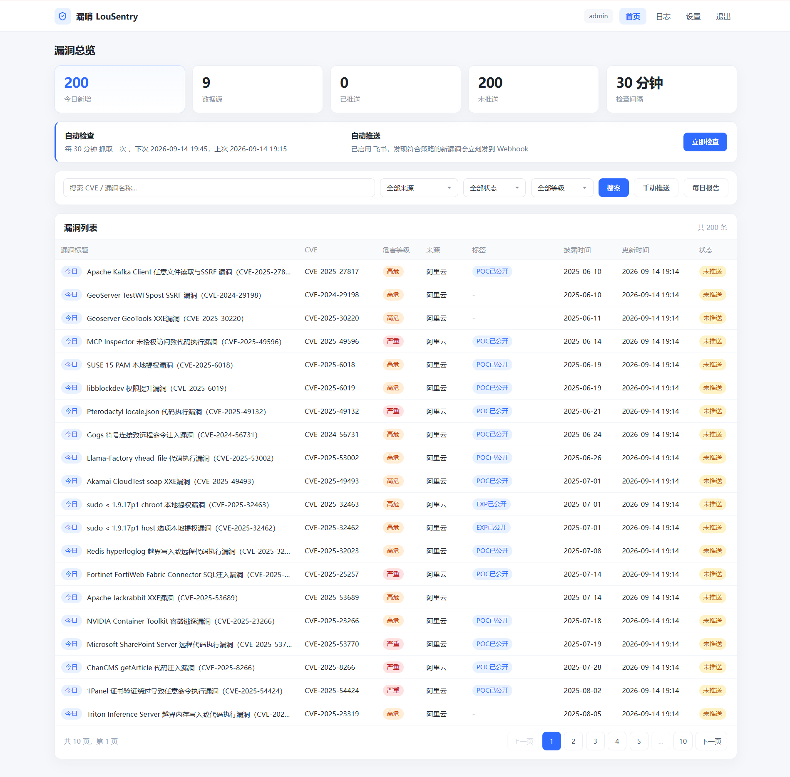
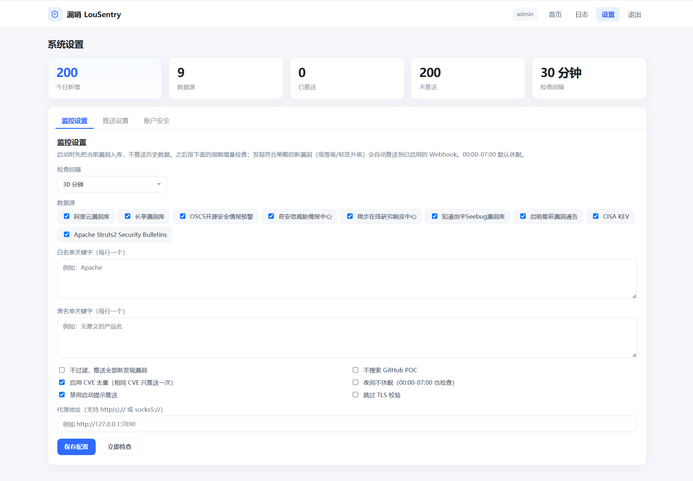
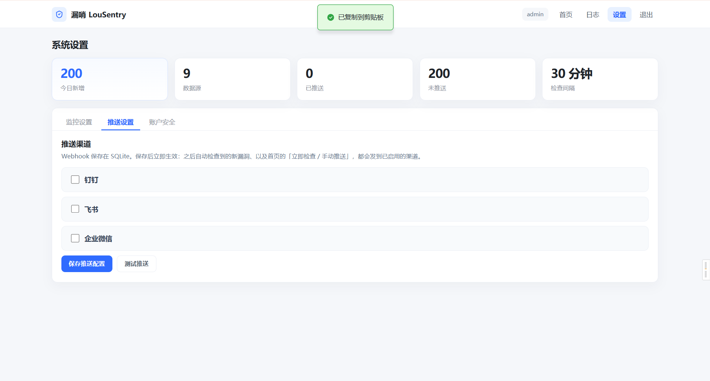

# 漏哨 LouSentry

当前版本：**v1.0.02**

采集高价值漏洞，按周期检查并推送到钉钉 / 飞书 / 企业微信。

- 代码仓库：https://github.com/billy-shang/lousentry
- Docker 镜像：https://hub.docker.com/r/billyshang/lousentry

`漏哨` 的意思是：像哨兵一样盯着当下真正需要注意的漏洞，有新情况立刻报上来。英文名 `LouSentry`，二进制为 `lousentry`。

CVE 库里绝大多数编号并没有现实威胁。这个项目从部分高质量公开源抓取信息，过滤出高价值漏洞再推送，避免被各类 RSS 和公众号淹没。采集与推送逻辑源自开源项目 WatchVuln，当前版本增加了 Web 控制台，并把推送渠道收敛为国内常用的三种机器人。

当前抓取了这几个站点的数据:

| 名称                         | 地址                                                                                              | 推送策略                                             |
|----------------------------|-------------------------------------------------------------------------------------------------|--------------------------------------------------|
| 阿里云漏洞库                     | https://avd.aliyun.com/high-risk/list                                                           | 等级为高危或严重                                         |
| 长亭漏洞库                      | https://stack.chaitin.com/vuldb/index                                                           | 等级为高危或严重**并且**标题含中文                              |
| OSCS开源安全情报预警               | https://www.oscs1024.com/cm                                                                     | 等级为高危或严重**并且**包含 `预警` 标签                         |
| 奇安信威胁情报中心                  | https://ti.qianxin.com/                                                                         | 等级为高危严重**并且**包含 `奇安信CERT验证` `POC公开` `技术细节公布`标签之一 |
| 微步在线研究响应中心(公众号)            | https://x.threatbook.com/v5/vulIntelligence                                                     | 等级为高危或严重                                         |
| 知道创宇Seebug漏洞库              | https://www.seebug.org/                                                                         | 等级为高危或严重                                         |
| 启明星辰漏洞通告                   | https://www.venustech.com.cn/new_type/aqtg/                                                     | 等级为高危或严重                                         |
| CISA KEV                   | https://www.cisa.gov/known-exploited-vulnerabilities-catalog                                    | 全部推送                                             |
| Struts2 Security Bulletins | [Struts2 Security Bulletins](https://cwiki.apache.org/confluence/display/WW/Security+Bulletins) | 等级为高危或严重                                         |

> 所有信息来自网站公开页面, 如果有侵权，请提交 issue, 我会删除相关源。
>
> 如果有更好的信息源也可以反馈给我，需要能够响应及时 & 有办法过滤出有价值的漏洞

具体来说，消息的推送有两种情况, 两种情况有内置去重，不会重复推送:

- 新建的漏洞符合推送策略，直接推送,
- 新建的漏洞不符合推送策略，但漏洞信息被更新后符合了推送策略，也会被推送

## Web 控制台

内置 Web 控制台，默认监听 `:8080`。打开浏览器访问 `http://服务器IP:8080` 即可登录。

默认账号：
- 用户名：`admin`
- 密码：`admin123`（建议登录后立刻在「设置 → 账户安全」修改，也可在此添加更多登录账号）









## Docker 部署

镜像默认用 **SQLite**，数据库文件在容器内的 `/app/data/vuln_v3.sqlite3`。把这个目录挂成 Docker 卷后，重启、升级镜像都不会丢账号、监控配置、推送 webhook 和已采集的漏洞。

漏洞列表属于可重建数据，可以清空后重新采集；`web_users` / `web_settings` / `web_pushers` 会保留在同一份 SQLite 里，随数据卷一起持久化。

### 一条命令启动

```powershell
docker run -d --name lousentry --restart unless-stopped \
  -p 8083:8080 \
  -v /data/lousentry:/app/data \
  billyshang/lousentry:latest
```

或使用仓库里的 `docker-compose.yaml`：

```powershell
docker compose up -d
```